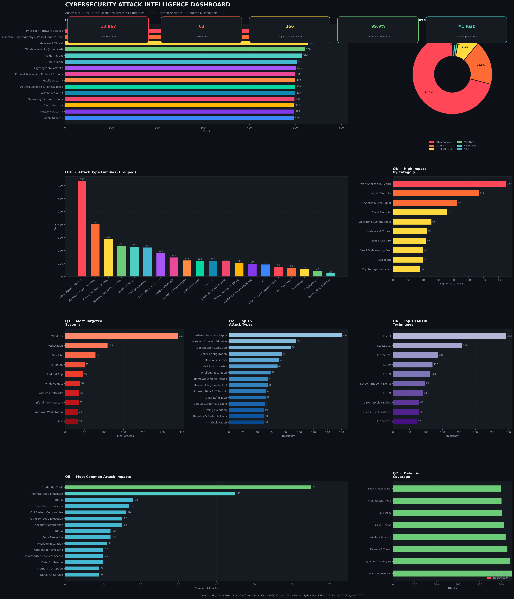

# 🛡️ Cybersecurity Attack Intelligence — SQL & Python Analytics Project



## 📌 Project Overview

This project analyses **13,867 documented cybersecurity attack scenarios** spanning 63 attack categories — from SQL Injection and Malware to AI/LLM Exploits, Quantum Cryptography threats, Physical Hardware attacks, and everything in between.

The goal was to apply a full end-to-end data analytics pipeline to a real-world cybersecurity dataset: starting from raw data, identifying and fixing quality issues, loading into a relational database, running structured SQL analysis, and building Python visualisations to surface actionable intelligence.

This project demonstrates skills directly applicable to **Security Operations Analyst**, **Risk Analyst**, and **Data Analyst** roles — specifically the ability to analyse incident and threat data, identify risk patterns, and communicate findings clearly through dashboards and reports.

---

## 🗂️ Repository Structure

```
cybersecurity-attack-analysis/
│
├── data/
│   ├── Attack_Dataset.csv                  # Original raw dataset
│   └── Attack_Dataset_Cleaned.csv          # Cleaned dataset (post-QA)
│
├── sql/
│   └── Cybersecurity_Attack_Analysis.sql   # Full MySQL analysis script
│
├── python/
│   └── Cybersecurity_Attack_Analysis.py    # Full Python analysis & visuals
│
├── notebooks/
│   └── cyber_security_project_full_python.ipynb  # Jupyter Notebook version
│
├── visuals/
│   ├── 00_full_dashboard.png               # Complete multi-panel dashboard
│   ├── 01_attacks_by_category.png
│   ├── 02_attack_type_families.png
│   ├── 03_most_targeted_systems.png
│   ├── 04_high_impact_by_category.png
│   ├── 05_mitre_techniques.png
│   ├── 06_source_distribution.png
│   ├── 07_common_impacts.png
│   └── 08_detection_coverage.png
│
└── README.md
```

---

## 🧰 Tools & Technologies

| Layer | Tools Used |
|---|---|
| Data Cleaning | Python, Pandas |
| Database & SQL | MySQL (SQLite for local execution) |
| Analysis & Visuals | Python, Matplotlib, NumPy |
| Notebook | Jupyter Notebook |
| Version Control | Git, GitHub |

---

## 🔍 Data Quality Issues Found & Resolved

Before any analysis could begin, the raw dataset required thorough QA. The following issues were identified and fixed using Python:

| # | Issue | Fix | Rows Affected |
|---|---|---|---|
| 1 | Trailing unnamed blank column with stray data | Removed column, preserved values in `Notes` column | 46 |
| 2 | `"Attack Steps "` column had trailing space in header | Renamed to `"Attack Steps"` | All |
| 3 | Category casing inconsistency (`"Network security"` vs `"Network Security"`) | Standardised to `"Network Security"` | 2 |
| 4 | MITRE Technique field mixed em dash `–` and hyphen `-` formats | Standardised all to hyphen | 5,232 |
| 5 | Duplicate rows (same title + same content) | Removed true duplicates, kept same-title/different-content rows | 266 removed |
| 6 | Data bleed in `Target Type` column (attack step text overflowing) | Truncated and flagged with `[DATA BLEED DETECTED]` | 53 |
| 7 | Missing `Source` values | Filled with `"Unknown"` | 159 |

**Original row count:** 14,133 → **Cleaned row count:** 13,867

---

## 💾 SQL Analysis

The SQL script (`Cybersecurity_Attack_Analysis.sql`) follows a structured workflow:

1. **Database setup** — creates `cybersecurity_db` and the `attacks` table
2. **Exploration** — `SELECT *`, `COUNT`, `DISTINCT` queries to understand the data
3. **Staging table** — creates `attacks_staging` as a working copy to preserve the raw table
4. **Cleaning in SQL** — fixes remaining casing issues, trims whitespace, adds and populates `attack_family` column using a `CASE` grouping statement
5. **Analysis queries (Q1–Q10)** — structured business questions answered with SQL
6. **Bonus queries** — unique attack types per category, critical impact analysis, tool frequency, and cross-tab category vs family breakdown

### Questions Answered

| Query | Question |
|---|---|
| Q1 | How many attacks are recorded per category? |
| Q2 | What are the top 15 most common specific attack types? |
| Q3 | Which system types are most frequently targeted? |
| Q4 | Which MITRE ATT&CK techniques are most referenced? |
| Q5 | What are the most common attack impacts? |
| Q6 | Which categories have attacks with no documented solution? |
| Q7 | What is the detection method coverage per category? |
| Q8 | Which categories contain the most high-impact attacks? |
| Q9 | How are attack sources distributed across known security frameworks? |
| Q10 | How do 8,833 unique attack types group into broader attack families? |

---

## 📊 Python Analysis & Visualisations

The Python script (`Cybersecurity_Attack_Analysis.py`) replicates all SQL analysis in Python using Pandas, adds feature engineering, and produces 8 individual charts plus a full multi-panel dashboard.

### Feature Engineering
- `attack_family` — maps 8,833+ raw attack type values into 19 meaningful attack families using keyword-matching logic (mirrors the SQL `CASE` grouping)
- `is_high_impact` — boolean flag for records mentioning data theft, privilege escalation, ransomware, account takeover, or remote code execution in the impact field
- `has_detection` — binary flag indicating whether a detection method is documented
- `source_group` — groups raw source strings into known security framework buckets (OWASP, MITRE ATT&CK, CVE/NVD, NIST, Other)

### Charts Produced

| File | Chart | Description |
|---|---|---|
| `01_attacks_by_category.png` | Horizontal bar | Attack count per category, top 15 |
| `02_attack_type_families.png` | Vertical bar | Grouped attack families excl. "Other" |
| `03_most_targeted_systems.png` | Horizontal bar | Top 10 most targeted system types |
| `04_high_impact_by_category.png` | Horizontal bar | Categories ranked by high-impact attack count |
| `05_mitre_techniques.png` | Horizontal bar | Top 10 MITRE ATT&CK techniques referenced |
| `06_source_distribution.png` | Donut chart | Share of records by known security framework |
| `07_common_impacts.png` | Horizontal bar | Most common documented attack impacts |
| `08_detection_coverage.png` | Stacked bar | Detection coverage (has vs. no detection method) |
| `00_full_dashboard.png` | Multi-panel | All charts combined in one dashboard |

---

## 📈 Key Findings

1. **Physical / Hardware Attacks** is the largest single category with 548 records, reflecting growing concern over hardware-level threats including JTAG exploitation, fault injection, and side-channel attacks.

2. **Windows is the most targeted system** — appearing 291 times, more than 2.6× the next entry (Workstations at 109). Windows remains the dominant attack surface globally.

3. **Web Application Security leads all categories for high-impact attacks** (150 records), followed closely by AI/ML Security (114) — signalling that AI systems are now a primary threat vector alongside traditional web apps.

4. **MITRE technique T1203** (Exploitation for Client Execution) is the most referenced at 343 occurrences, indicating client-side exploitation remains a dominant attacker strategy.

5. **Credential Theft is the most common attack outcome** (65 combined records), followed by Remote Code Execution (45). Stolen credentials remain the primary entry point for most modern attacks.

6. **Detection coverage is 99.9%** — only 3 records across the entire dataset lack a documented detection method, confirming strong dataset quality after cleaning.

7. **OWASP is the most cited known security framework** (2,522 records), followed by MITRE ATT&CK (1,633). Together they account for ~30% of all sourced records.

8. **Dependency Confusion** stands out as a top specific attack type (88 records), reflecting the explosion of supply chain attacks targeting package ecosystems like npm, PyPI, and Maven.

9. **The dataset is evenly distributed** across all 63 categories (~3.5–4% each), suggesting it was deliberately balanced to provide comprehensive coverage of every attack domain.

10. **After cleaning, 266 duplicate rows were removed** (1.9% of original data) — confirming that even well-structured public datasets require thorough quality assurance before analysis.

---

## ▶️ How to Run

### SQL (MySQL)
```sql
-- 1. Open MySQL Workbench or your preferred MySQL client
-- 2. Import Attack_Dataset_Cleaned.csv into the attacks table
-- 3. Run Cybersecurity_Attack_Analysis.sql step by step
```

### Python
```bash
# Install dependencies
pip install pandas matplotlib numpy

# Run the script
python Cybersecurity_Attack_Analysis.py
```

### Jupyter Notebook
```bash
pip install jupyter pandas matplotlib numpy
jupyter notebook cyber_security_project_full_python.ipynb
```

---

## 📁 Dataset

- **Source:** Kaggle — Cybersecurity Attack Dataset
- **Original size:** 14,133 records × 16 columns
- **Cleaned size:** 13,867 records × 16 columns + `Notes` column
- **Columns:** ID, Title, Category, Attack Type, Scenario Description, Tools Used, Attack Steps, Target Type, Vulnerability, MITRE Technique, Impact, Detection Method, Solution, Tags, Source, Notes

---

## 👤 Author

**Sibusiso D. Mbuyane**
Data Analyst | Python · SQL · Power BI · Tableau

🔗 [GitHub](https://github.com/Sibusiso08) · [LinkedIn](https://linkedin.com/in/devenmbuyane/) · [Personal Website](https://sibusiso08.github.io/DevenMbuyane.github.io/)
